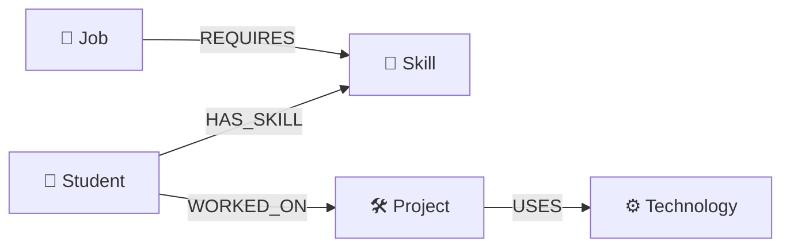
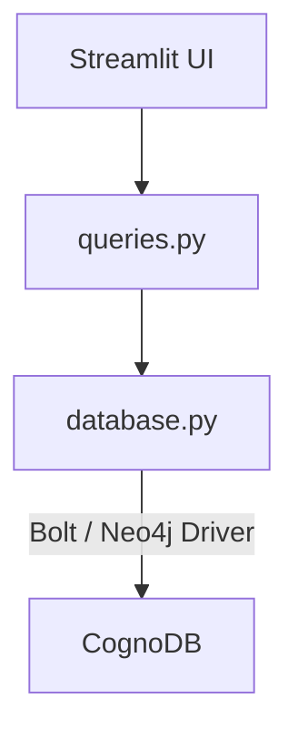

# 🔗 SkillGraph

### A Graph-Based Student Skill, Project & Career Explorer

> **Wexa AI — Candidate Take-Home Assignment: Build a Graph Database Application**

SkillGraph is a web application backed by **CognoDB**, a managed graph database. It models students, skills, projects, technologies, and jobs as interconnected entities and provides an interactive interface for exploring those relationships.

---

## 📑 Quick Navigation

* [🎯 Problem Statement](#-problem-statement)
* [💡 Use Case](#-use-case)
* [🧠 Why a Graph Database?](#-why-a-graph-database)
* [🗂️ Graph Data Model](#️-graph-data-model)
* [🏗️ Architecture](#️-application-architecture)
* [🛠️ Technology Stack](#️-technology-stack)
* [📁 Project Structure](#-project-structure)
* [☁️ CognoDB Setup](#️-cognodb-setup)
* [🔐 Environment Variables](#-environment-variables)
* [⚙️ Installation](#️-local-installation)
* [🌱 Seed the Database](#-seed-the-database)
* [▶️ Run the Application](#️-run-the-application)
* [🔍 Main Cypher Queries](#-main-graph-queries)
* [🔗 Graph Explorer](#-graph-explorer)
* [🎨 UI/UX](#-uiux-features)
* [📸 Screenshots](#-screenshots)
* [🎥 Screen Recording](#-screen-recording)
* [🔒 Security](#-security)
* [⚠️ Error Handling](#️-error-handling)
* [📊 Assignment Requirements Mapping](#-assignment-requirements-mapping)
* [✅ Final Submission Checklist](#-final-submission-checklist)
* [👨‍💻 Author](#-author)

---

## 🚀 Live Demo

| Resource                  | Link                             |
| ------------------------- | -------------------------------- |
| 🌐 **Hosted Application** | `ADD_HOSTED_DEMO_URL_HERE`       |
| 💻 **GitHub Repository**  | `ADD_GITHUB_REPOSITORY_URL_HERE` |
| 🎥 **Screen Recording**   | `ADD_SCREEN_RECORDING_URL_HERE`  |

> Replace the three placeholders above before submitting.

---

# 🎯 Problem Statement

Students often have skills, projects, technologies, and career opportunities that are related to one another, but these relationships can be difficult to explore when information is represented as isolated records.

SkillGraph focuses on questions such as:

* Which students have a particular skill?
* Which technologies are used by a project?
* Which projects are connected to a student's skills?
* Which jobs require skills possessed by a student?
* Which students are the strongest candidates for a job?

These are fundamentally **relationship-oriented questions**.

SkillGraph represents these entities and relationships as a graph so that connected information can be traversed naturally.

---

# 💡 Use Case

SkillGraph provides an interactive way to explore relationships between:

```text
👤 Students
    │
    ├── HAS_SKILL ────────> 🧠 Skills
    │
    └── WORKED_ON ────────> 🛠️ Projects
                                │
                                └── USES ────> ⚙️ Technologies

💼 Jobs
    │
    └── REQUIRES ──────────> 🧠 Skills
```

## 🔎 Student Explorer

Find students who possess a selected skill.

Example:

```text
Python
   │
   └── HAS_SKILL
          │
          ├── Pranav
          ├── Ananya
          ├── Rahul
          └── Sneha
```

## 🛠️ Project Explorer

Explore the technology stack behind a project.

Example:

```text
AI PDF Explainer
   ├── Python
   ├── Streamlit
   ├── Gemini
   └── MoviePy
```

## 💼 Job Matching

Rank students according to how many required job skills they possess.

Example:

```text
AI Developer Intern
       │
       ├── Python
       ├── SQL
       └── Machine Learning

Pranav  ────────── 3/3
Ananya  ────────── 3/3
Rahul   ────────── 2/3
```

## 🔗 Graph Explorer

Explore a student's connected graph:

```text
Student
   │
   ├── HAS_SKILL ──> Skill
   │
   └── WORKED_ON ──> Project
                         │
                         └── USES ──> Technology

Skill
   ▲
   │
REQUIRES
   │
   ▼
Job
```

---

# 🧠 Why a Graph Database?

The central value of SkillGraph is its focus on **connections and relationships**.

A relational design could require tables such as:

```text
Students
Skills
StudentSkills
Projects
StudentProjects
Technologies
ProjectTechnologies
Jobs
JobSkills
```

Relationship-heavy questions would then require several joins.

SkillGraph represents the relationships directly:

```cypher
(Student)-[:HAS_SKILL]->(Skill)

(Student)-[:WORKED_ON]->(Project)

(Project)-[:USES]->(Technology)

(Job)-[:REQUIRES]->(Skill)
```

This makes connected traversal natural.

For example:

```text
Student
   ↓
HAS_SKILL
   ↓
Skill
   ↑
REQUIRES
   ↑
Job
```

This allows SkillGraph to answer questions such as:

> "Which jobs are related to the skills of this student?"

without treating each relationship as an unrelated table join.

---

# 🗂️ Graph Data Model

## Node Types

### 👤 Student

Properties:

```text
name
year
department
```

Example:

```text
Student {
    name: "Pranav",
    year: 3,
    department: "CSE"
}
```

### 🧠 Skill

Properties:

```text
name
category
```

Example:

```text
Skill {
    name: "Python",
    category: "Programming"
}
```

### 🛠️ Project

Properties:

```text
name
description
```

Example:

```text
Project {
    name: "AI PDF Explainer",
    description: "AI-powered application that explains educational PDF documents."
}
```

### ⚙️ Technology

Properties:

```text
name
category
```

Example:

```text
Technology {
    name: "Streamlit",
    category: "Framework"
}
```

### 💼 Job

Properties:

```text
title
company
location
```

Example:

```text
Job {
    title: "AI Developer Intern",
    company: "Wexa AI",
    location: "Remote"
}
```

---

## 🔗 Relationships

```text
Student ──HAS_SKILL──> Skill

Student ──WORKED_ON──> Project

Project ──USES──> Technology

Job ──REQUIRES──> Skill
```

### Complete Conceptual Graph



---

# 🏗️ Application Architecture



## Architecture Layers

| Layer         | Responsibility                                              |
| ------------- | ----------------------------------------------------------- |
| `app.py`      | Streamlit interface and user interactions                   |
| `queries.py`  | Parameterized Cypher queries and graph operations           |
| `database.py` | CognoDB connection through the official Neo4j Python driver |
| `seed.py`     | Creation of realistic graph data                            |
| `CognoDB`     | Persistent graph database                                   |

---

# 🛠️ Technology Stack

| Component         | Technology                   |
| ----------------- | ---------------------------- |
| Language          | Python                       |
| Python Version    | Python 3.14.2                |
| Web Framework     | Streamlit                    |
| Database          | CognoDB                      |
| Query Language    | openCypher                   |
| Database Protocol | Bolt                         |
| Driver            | Official Neo4j Python Driver |
| Configuration     | Environment Variables        |
| Version Control   | Git / GitHub                 |

---

# 📁 Project Structure

```text
SkillGraph/
│
├── app.py
├── database.py
├── queries.py
├── seed.py
│
├── requirements.txt
│
├── .env
├── .env.example
├── .gitignore
│
├── README.md
│
└── screenshots/
    ├── student-explorer.png
    ├── project-explorer.png
    ├── job-matching.png
    └── graph-explorer.png
```

### File Responsibilities

<details>
<summary>📄 app.py</summary>

Contains the Streamlit interface, navigation, controls, result rendering, loading states, empty states, and error messages.

</details>

<details>
<summary>📄 database.py</summary>

Creates the CognoDB connection using the official Neo4j Python driver and reads credentials from environment variables.

</details>

<details>
<summary>📄 queries.py</summary>

Contains the application's parameterized Cypher queries and graph traversal logic.

</details>

<details>
<summary>📄 seed.py</summary>

Loads the realistic demonstration dataset into CognoDB and creates the required nodes and relationships.

</details>

<details>
<summary>📄 .env</summary>

Contains local database credentials. It must never be committed to GitHub.

</details>

<details>
<summary>📄 .env.example</summary>

Contains only the required environment-variable names and no real credentials.

</details>

---

# ☁️ CognoDB Setup

SkillGraph uses CognoDB as its graph database layer.

## 1. Create an Account

Create a CognoDB Cloud account through the CognoDB console.

## 2. Create an Instance

Create a free `c0` instance and select a region.

## 3. Save Connection Details

The database provides a Bolt connection URI and the generated database credentials.

> Keep the generated password secure.

## 4. Configure SkillGraph

Place the connection information in `.env`.

---

# 🔐 Environment Variables

Create a `.env` file in the project root:

```env
COGNODB_URI=your_cognodb_uri
COGNODB_USERNAME=cognodb
COGNODB_PASSWORD=your_cognodb_password
```

Create `.env.example`:

```env
COGNODB_URI=
COGNODB_USERNAME=
COGNODB_PASSWORD=
```

## `.gitignore`

Make sure the following are ignored:

```gitignore
.env
venv/
__pycache__/
*.pyc
.DS_Store
```

> **Never commit the real `.env` file or database password.**

---

# ⚙️ Local Installation

## Clone the repository

```bash
git clone YOUR_REPOSITORY_URL
cd SkillGraph
```

## Create a virtual environment

macOS / Linux:

```bash
python3 -m venv venv
```

## Activate it

```bash
source venv/bin/activate
```

## Install dependencies

```bash
pip install -r requirements.txt
```

---

# 🌱 Seed the Database

SkillGraph includes:

```text
seed.py
```

Run:

```bash
python3 seed.py
```

The seed script creates:

```text
Students
Skills
Projects
Technologies
Jobs
```

and relationships:

```text
HAS_SKILL
WORKED_ON
USES
REQUIRES
```

The dataset is intentionally small and realistic enough to demonstrate the graph use case clearly.

---

# ▶️ Run the Application

Start Streamlit:

```bash
python3 -m streamlit run app.py
```

Open:

```text
http://localhost:8501
```

---

# 🔍 Main Graph Queries

## Query 1 — Find Students by Skill

```cypher
MATCH (student:Student)-[:HAS_SKILL]->(skill:Skill)
WHERE skill.name = $skill_name

RETURN
    student.name AS name,
    student.year AS year,
    student.department AS department

ORDER BY student.name
```

### Traversal

```text
Student
   ↓
HAS_SKILL
   ↓
Skill
```

### Purpose

Find students connected to a selected skill.

---

## Query 2 — Find Project Technologies

```cypher
MATCH (project:Project)-[:USES]->(technology:Technology)
WHERE project.name = $project_name

RETURN
    technology.name AS name,
    technology.category AS category

ORDER BY technology.name
```

### Traversal

```text
Project
   ↓
USES
   ↓
Technology
```

### Purpose

Find the technologies used by a selected project.

---

## Query 3 — Find Jobs Related to Student Skills

```cypher
MATCH (student:Student)-[:HAS_SKILL]->(skill:Skill)
      <-[:REQUIRES]-(job:Job)

WHERE student.name = $student_name

RETURN
    job.title AS title,
    job.company AS company,
    job.location AS location,
    collect(DISTINCT skill.name) AS matching_skills

ORDER BY size(matching_skills) DESC
```

### Traversal

```text
Student
   ↓
HAS_SKILL
   ↓
Skill
   ↑
REQUIRES
   ↑
Job
```

This is a multi-hop graph traversal.

---

# ⭐ Job Matching

SkillGraph ranks students against job requirements.

Conceptually:

```text
Matched Skills
─────────────── × 100
Required Skills
```

Example:

```text
Required Skills:
Python
SQL
Machine Learning

Student:
Python
SQL
Machine Learning

Score:
3 / 3 = 100%
```

The application displays matching candidates using cards, badges, and progress indicators.

---

# 🔗 Graph Explorer

The Graph Explorer demonstrates the broader value of the graph model.

A selected student can be connected to:

```text
Student
   │
   ├── HAS_SKILL ──> Skills
   │
   └── WORKED_ON ──> Projects
                         │
                         └── USES ──> Technologies
```

Their skills can also connect to relevant jobs:

```text
Student
   │
HAS_SKILL
   │
   ▼
Skill
   ▲
   │
REQUIRES
   │
   ▼
Job
```

This creates a connected student → skill → project → technology → career view.

---

# 🎨 UI/UX Features

SkillGraph is designed for use by a non-technical user.

### Included

* 🔎 Student Explorer
* 🛠️ Project Explorer
* 💼 Job Matching
* 🔗 Graph Explorer
* 📊 Match scores
* 🏷️ Skill badges
* ⏳ Loading indicators
* ℹ️ Empty states
* 🚨 Database error handling
* 📱 Responsive layout
* 🧭 Clear tab-based navigation
* 🎨 Consistent card-based visual design

---

# 📸 Screenshots

Add the final screenshots to the `screenshots/` directory.

## Student Explorer


Shows students connected to a selected skill.

---

## Project Explorer


Shows technologies connected to a selected project.

---

## Job Matching


Shows ranked candidates and their matching requirements.

---

## Graph Explorer


Shows the connected graph information for a selected student.

---

# 🎥 Screen Recording

The short screen recording should demonstrate the complete workflow:

```text
1. Open SkillGraph
        ↓
2. Student Explorer
        ↓
3. Search for a skill
        ↓
4. Show matching students
        ↓
5. Project Explorer
        ↓
6. Show project technologies
        ↓
7. Job Matching
        ↓
8. Show ranked candidates
        ↓
9. Graph Explorer
        ↓
10. Show connected student graph
```

**Recording:** `ADD_SCREEN_RECORDING_URL_HERE`

---

# 🔒 Security

Database credentials are loaded from environment variables:

```text
COGNODB_URI
COGNODB_USERNAME
COGNODB_PASSWORD
```

Credentials are not hard-coded in application source files.

The `.env` file is excluded through `.gitignore`.

No password or secret should appear in:

* Source code
* Git commits
* Screenshots
* README
* Screen recordings
* Public deployment configuration

---

# ⚠️ Error Handling

SkillGraph handles database failures and empty query results gracefully.

For database failures, the application displays a user-friendly message rather than crashing silently.

Example:

```text
🚨 SkillGraph could not load data from CognoDB.
```

For empty results:

```text
ℹ️ No students found with the selected skill.
```

Loading states are also shown while graph queries are executing.

---

# 📊 Assignment Requirements Mapping

| Wexa Requirement            | SkillGraph Implementation                      | Status |
| --------------------------- | ---------------------------------------------- | -----: |
| Thoughtful graph data model | Students, Skills, Projects, Technologies, Jobs |      ✅ |
| Labeled nodes               | Node labels for all entities                   |      ✅ |
| Typed relationships         | HAS_SKILL, WORKED_ON, USES, REQUIRES           |      ✅ |
| Node properties             | Entity-specific properties                     |      ✅ |
| Data-model diagram          | Mermaid graph + text diagram                   |      ✅ |
| Realistic seed data         | `seed.py`                                      |      ✅ |
| Seed script in repository   | `seed.py`                                      |      ✅ |
| Cypher queries              | `queries.py`                                   |      ✅ |
| Multi-hop traversal         | Student → Skill ← Job                          |      ✅ |
| Graph-specific query        | Job/skill relationship exploration             |      ✅ |
| Parameterized queries       | `$parameter` values through Neo4j driver       |      ✅ |
| Official Neo4j driver       | Neo4j Python driver                            |      ✅ |
| Functional web application  | Streamlit                                      |      ✅ |
| Non-technical UX            | Explorer-based interface                       |      ✅ |
| Loading states              | Streamlit spinners                             |      ✅ |
| Empty states                | Informational messages                         |      ✅ |
| Error handling              | Database/query exception handling              |      ✅ |
| Environment variables       | `.env` configuration                           |      ✅ |
| Source code                 | GitHub repository                              |      ⬜ |
| README                      | This document                                  |      ✅ |
| UI screenshots              | `screenshots/`                                 |      ⬜ |
| Hosted application          | Deployment URL                                 |      ⬜ |
| Screen recording            | Recording URL                                  |      ⬜ |

> The final four unchecked items should be completed before submission.

---

# 🧪 Testing Checklist

Use this checklist before submitting:

* [ ] CognoDB instance is running
* [ ] `.env` contains valid credentials
* [ ] `.env` is in `.gitignore`
* [ ] `seed.py` runs successfully
* [ ] Student Explorer works
* [ ] Project Explorer works
* [ ] Job Matching works
* [ ] Graph Explorer works
* [ ] Empty states work
* [ ] Database error state works
* [ ] No duplicate input controls are visible
* [ ] Application works in Chrome
* [ ] Application works on the hosted URL
* [ ] README links are updated
* [ ] Screenshots are added
* [ ] Screen recording is uploaded
* [ ] GitHub repository is accessible
* [ ] No credentials are committed
* [ ] CognoDB instance remains running for evaluation

---

# 📦 Final Submission Checklist

Before sending the email to Wexa AI:

```text
☐ GitHub repository
☐ Hosted application
☐ README
☐ Seed script
☐ Full source code
☐ Cypher queries
☐ Data model diagram
☐ UI screenshots
☐ Short screen recording
☐ No exposed credentials
☐ CognoDB instance running
```

---

# 📧 Submission

The assignment requests the GitHub repository URL and hosted demo link to be submitted to:

```text
hr@wexa.ai
```

Suggested subject:

```text
CognoDB Assignment 2 – Pranav Vedula
```

---

# 👨‍💻 Author

## Pranav Vedula

**B.Tech — Computer Science Engineering**

### Project

**SkillGraph**

> A graph-based application for exploring relationships between students, skills, projects, technologies, and career opportunities.

---

## 📄 Assignment Context

This project was developed for the Wexa AI candidate take-home assignment requiring a complete application backed by a graph database.

The project uses:

* **CognoDB** as the graph database
* **openCypher** for graph queries
* **Official Neo4j Python Driver** for database communication
* **Streamlit** for the web application

---

## ⭐ SkillGraph at a Glance

```text
                    🔗 SkillGraph

              STUDENTS ↔ SKILLS
                  │         │
                  │         │
             PROJECTS     JOBS
                  │         │
                  │         │
             TECHNOLOGIES   │
                  │         │
                  └─────────┘

       Explore → Traverse → Match → Discover
```

**Built to demonstrate why relationships matter.**
