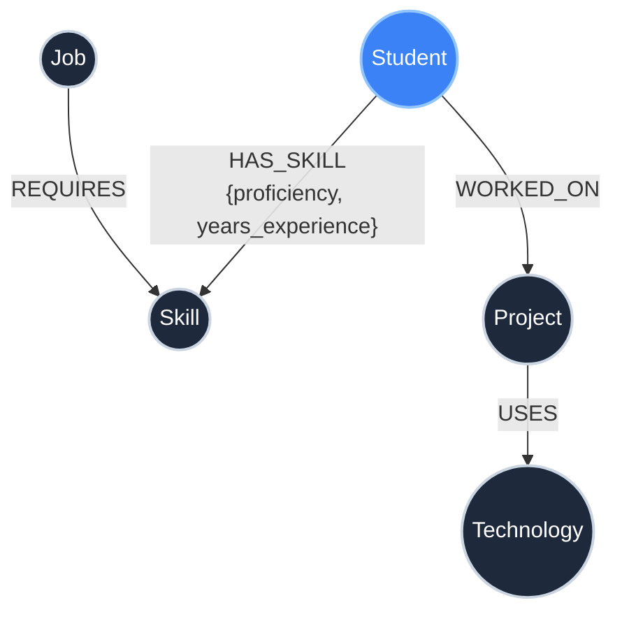
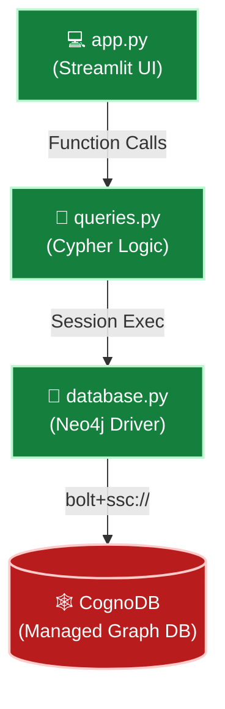

<div align="center">
  
# 🕸️ SkillGraph

**A High-Performance Graph Database Application** <br>
*Built with Python, Streamlit, and CognoDB for the Wexa AI Engineering Challenge*

[](https://python.org)
[](https://streamlit.io)
[](https://neo4j.com)
[](https://cognodb.com)

[**Live Demo**](https://graphdb-application-pranavvedula.streamlit.app/) • [**Architecture**](#-application-architecture) • [**Cypher Queries**](#-the-power-of-cypher-queries)

</div>

---

## 💡 The Challenge: Why a Graph Database?

When building a recommendation engine that maps **Students ↔ Skills ↔ Projects ↔ Technologies ↔ Jobs**, traditional relational databases (SQL) hit a wall. 

In a relational database, answering a simple question like *"Which jobs match a student's skills?"* requires traversing three different join tables (`StudentSkills`, `JobSkills`, etc.). As the dataset grows, these `JOIN` operations become exponentially expensive and difficult to maintain.

**The Solution:** SkillGraph uses a natively connected **Graph Database (CognoDB)**. Relationships are treated as first-class citizens. Instead of joining tables, we traverse the graph. What takes a massive, slow SQL query takes a split-second, highly readable **Cypher** traversal in SkillGraph.

---

## 🏗️ Graph Data Model

The backbone of this application is a highly optimized graph schema. Every node and relationship is designed to make career and skill recommendations instant.



| 🟢 Nodes | 🔗 Relationships (Edges) |
|---|---|
| `Student` (name, year, gpa) | `HAS_SKILL` (Includes *proficiency* and *years_experience* properties!) |
| `Skill` (name, category) | `WORKED_ON` |
| `Project` (name, status) | `USES` |
| `Technology` (name) | `REQUIRES` |
| `Job` (title, salary, company) | |

---

## ⚡ The Power of Cypher Queries

I wrote parameterised Cypher queries to handle complex multi-hop graph traversals natively. This allows the backend to perform heavy lifting instantly.

### 1️⃣ The "Matchmaker" (Multi-Hop Ranking Engine)
This query traverses **Job → Skill → Student** in a single sweep. It calculates the overlap between a job's requirements and a student's abilities, ranking candidates by their match score. *In SQL, this would require correlated subqueries across three join tables.*
```cypher
MATCH (job:Job)-[:REQUIRES]->(required_skill:Skill)
WHERE job.title = $job_title
WITH job, collect(DISTINCT required_skill.name) AS required_skills

MATCH (student:Student)
OPTIONAL MATCH (student)-[:HAS_SKILL]->(student_skill:Skill)
WITH job, required_skills, student, collect(DISTINCT student_skill.name) AS student_skills

WITH student, required_skills,
     [skill IN required_skills WHERE skill IN student_skills] AS matching_skills
WHERE size(matching_skills) > 0

RETURN student.name AS student, size(required_skills) AS total_required, size(matching_skills) AS matched, matching_skills
ORDER BY matched DESC, student.name
```

### 2️⃣ The 3-Hop Deep Dive
This query pulls a student's entire universe in one go: what they know, what projects they've built, the technologies used in those projects, and the jobs they qualify for. *SQL equivalent: 5 `JOIN` operations.*
```cypher
MATCH (student:Student {name: $student_name})
OPTIONAL MATCH (student)-[:HAS_SKILL]->(skill:Skill)
WITH student, collect(DISTINCT skill) AS skills

OPTIONAL MATCH (student)-[:WORKED_ON]->(project:Project)
WITH student, skills, collect(DISTINCT project) AS projects

OPTIONAL MATCH (project:Project)-[:USES]->(technology:Technology)
WHERE project IN projects
WITH student, skills, projects, collect(DISTINCT technology) AS technologies

OPTIONAL MATCH (job:Job)-[:REQUIRES]->(job_skill:Skill)
WHERE job_skill IN skills
WITH student, skills, projects, technologies, collect(DISTINCT job) AS jobs

RETURN student.name AS student, skills, projects, technologies, jobs
```

---

## 🧩 Application Architecture

I architected the application with a strict separation of concerns, ensuring scalability and clean code.



**Key Engineering Decisions:**
- **Idempotent Data Seeding:** The `seed.py` script uses `MERGE` clauses exclusively. You can run it 100 times, and it will never create duplicate nodes or crash. 
- **Graceful Error Handling:** Wrapped the Neo4j driver in a safe `try/except` block and configured `atexit.register(driver.close)` to prevent connection leaks.
- **Clean UI:** Removed unnecessary visual clutter. Styled with clean CSS and custom `Inter` typography for a highly professional look.

---

## 📸 See it in Action

<div align="center">

| 🔎 Student Explorer | 💼 Job Matchmaker Engine |
|:---:|:---:|
|  |  |
| *Find experts with colour-coded proficiency badges.* | *Algorithmically rank candidates based on graph overlap.* |

| 🕸️ 3-Hop Student Graph | 🛠️ Project Architecture |
|:---:|:---:|
|  |  |
| *Traverse a student's entire connected network.* | *Break down real-world projects into core technologies.* |

</div>

---

## 🚀 Run It Locally

### 1. Configure the Environment
Clone the repository and set up your virtual environment:
```bash
git clone https://github.com/Pranavv-07/graphDB-application.git
cd graphDB-application
python -m venv venv
source venv/bin/activate
pip install -r requirements.txt
```

Create a `.env` file with your CognoDB credentials (get a free instance at [console.cognodb.com](https://console.cognodb.com/signup)):
```env
COGNODB_URI=bolt+ssc://<your-instance-id>.databases.cognodb.com
COGNODB_USERNAME=cognodb
COGNODB_PASSWORD=<your-password>
```

### 2. Hydrate the Graph
Run the idempotent seed script to generate 70+ interconnected nodes and relationships:
```bash
python seed.py
```

### 3. Launch the Application
```bash
streamlit run app.py
```
Open **http://localhost:8501** and start exploring the graph!

---

<div align="center">
  <b>Built by Pranav Vedula</b><br>
  <i>Showcasing Graph Database Architecture & Full-Stack Python Engineering</i>
</div>
